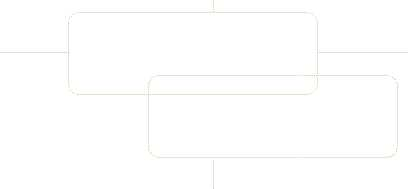



## Visual Basic Solutions \- A library to solve your visual basic programming problems

### Description

This is a library to solve your VB programming problems. There are currently 75 solved. Feel free to vote & leave comments if you benefit from this library.
 
### More Info
 

             |
---                |---
**Submitted On**   |2003-11-01 22:11:22
**By**             |[Lam Ri Hui](https://github.com/Planet-Source-Code/PSCIndex/blob/master/ByAuthor/lam-ri-hui.md)
**Level**          |Intermediate
**User Rating**    |4.9 (167 globes from 34 users)
**Compatibility**  |VB 3\.0, VB 4\.0 \(16\-bit\), VB 4\.0 \(32\-bit\), VB 5\.0, VB 6\.0
**Category**       |[Libraries](https://github.com/Planet-Source-Code/PSCIndex/blob/master/ByCategory/libraries__1-49.md)
**World**          |[Visual Basic](https://github.com/Planet-Source-Code/PSCIndex/blob/master/ByWorld/visual-basic.md)
**Archive File**   |[Visual\_Bas1666231122003\.zip](https://github.com/Planet-Source-Code/lam-ri-hui-visual-basic-solutions-a-library-to-solve-your-visual-basic-programming-problem__1-49599/archive/master.zip)

